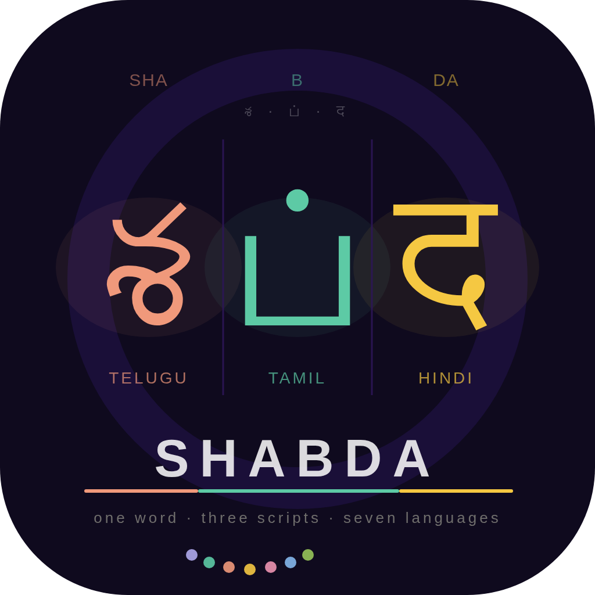
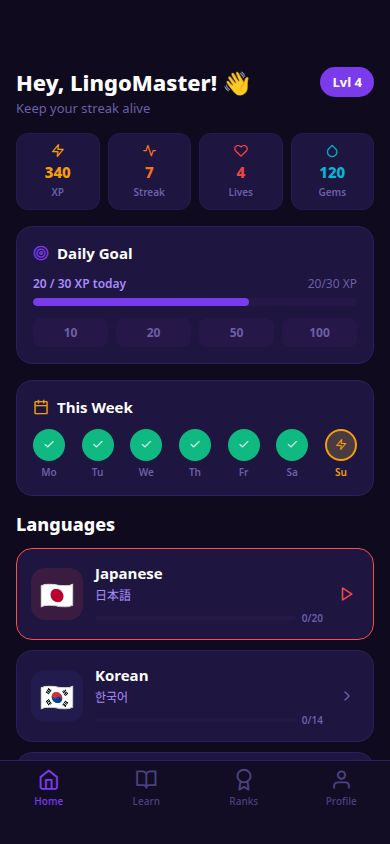
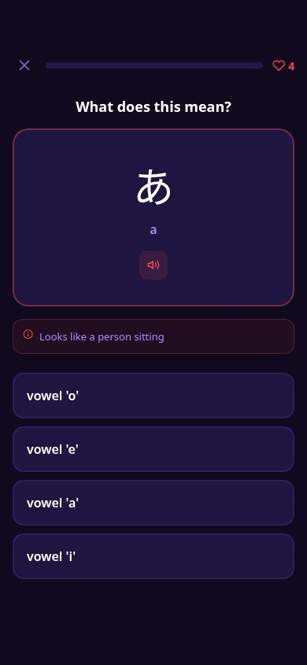
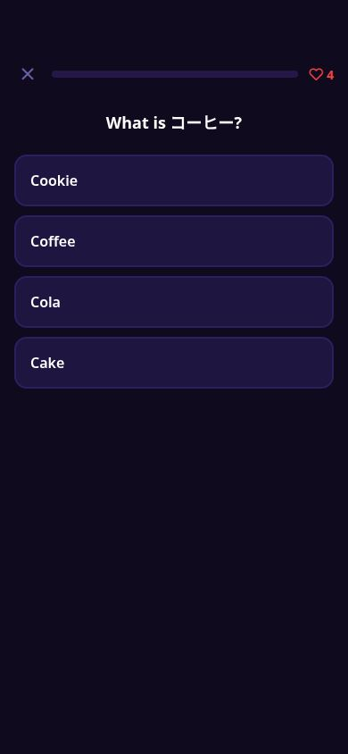
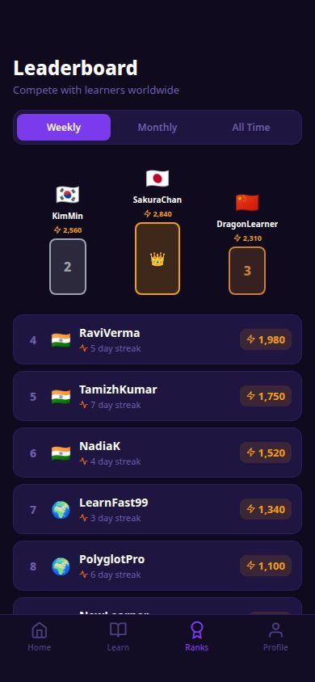

# Shabda — Learn Asian Languages

<p align="center">
  
</p>

<p align="center">
  <strong>శ · ப் · द</strong><br/>
  <em>One word. Three scripts. Seven languages.</em>
</p>

<p align="center">
  
  
  
  
  
</p>

---

## What is Shabda?

**Shabda** (శబ్దం · சப்தம் · शब्द) means *word* or *sound* in Sanskrit — and that is exactly what this app is about. Shabda is a Duolingo-style mobile language learning app for seven Asian languages, built with React Native and Expo.

Learn scripts, vocabulary, grammar, and culture through bite-sized gamified lessons, XP rewards, streak tracking, and boss challenge quizzes.

---

## Languages

| Language | Script | Difficulty | Lessons |
|---|---|---|---|
| 🇯🇵 Japanese | Hiragana · Katakana · Kanji | Hard | 68 |
| 🇰🇷 Korean | Hangul | Medium | 55 |
| 🇨🇳 Mandarin | Hanzi (Simplified) | Hard | 60 |
| 🇮🇳 Tamil | Tamil script | Hard | 55 |
| 🇮🇳 Telugu | Telugu script | Hard | 55 |
| 🇮🇳 Hindi | Devanagari | Medium | 60 |
| 🇮🇩 Bahasa Indonesia | Latin | Easy | 50 |

---

## Features

- **Script learning** — Hiragana, Katakana, Hangul, Devanagari, Tamil, Telugu, Hanzi taught from scratch
- **4–5 stages per language** — from phonetics and survival basics through grammar and fluency
- **Gamified XP system** — earn XP per lesson, track your streak daily
- **Boss challenge quizzes** — unlock after completing each unit
- **Leaderboard** — compete with other learners
- **Text-to-speech** — native audio for all 7 languages
- **Offline first** — all lesson content is bundled, no internet required for lessons
- **Culture lessons** — K-drama phrases, Bollywood expressions, Sangam poetry, gotong royong, and more

---

## Screenshots

| Home | Lesson | Quiz | Leaderboard |
|---|---|---|---|
|  |  |  |  |

---

## Tech Stack

| Layer | Technology |
|---|---|
| Framework | React Native + Expo SDK |
| Navigation | React Navigation v6 |
| State | React Context + AsyncStorage |
| Audio / TTS | Expo Speech |
| Data | Local JS data files (no backend) |
| Build | EAS Build (Expo Application Services) |

---

## Project Structure

```
shabda/
├── assets/
│   ├── icon.png               # 1024×1024 app icon
│   ├── splash.png             # Splash screen
│   └── screenshots/           # App Store / Play Store screenshots
├── src/
│   ├── data/
│   │   ├── languages.js       # Master export — all 7 languages
│   │   ├── japanese.js        # Japanese curriculum (68 lessons)
│   │   ├── korean.js          # Korean curriculum (55 lessons)
│   │   ├── mandarin.js        # Mandarin curriculum (60 lessons)
│   │   ├── tamil.js           # Tamil curriculum (55 lessons)
│   │   ├── telugu.js          # Telugu curriculum (55 lessons)
│   │   ├── hindi.js           # Hindi curriculum (60 lessons)
│   │   └── indonesian.js      # Bahasa Indonesia curriculum (50 lessons)
│   ├── screens/
│   │   ├── HomeScreen.js
│   │   ├── LanguageScreen.js
│   │   ├── StageScreen.js
│   │   ├── LessonScreen.js
│   │   ├── QuizScreen.js
│   │   └── LeaderboardScreen.js
│   ├── components/
│   └── context/
├── app.json                   # Expo config
├── eas.json                   # EAS build profiles
└── package.json
```

---

## Getting Started

### Prerequisites

- Node.js 18+
- npm or yarn
- Expo CLI: `npm install -g expo-cli`
- Expo Go app on your phone (for quick testing)

### Installation

```bash
# Clone the repository
git clone https://github.com/yourusername/shabda.git
cd shabda

# Install dependencies
npm install

# Start the development server
npx expo start
```

Scan the QR code with **Expo Go** (Android) or the **Camera app** (iOS) to run on your device instantly.

### Running on Simulators

```bash
# iOS Simulator (Mac only)
npx expo start --ios

# Android Emulator
npx expo start --android
```

---

## Building for Production

Shabda uses [EAS Build](https://docs.expo.dev/build/introduction/) for production builds.

```bash
# Install EAS CLI
npm install -g eas-cli

# Login to your Expo account
eas login

# Build for both platforms
eas build --platform all --profile production

# Submit to App Store and Play Store
eas submit --platform ios
eas submit --platform android
```

---

## Data Structure

Each language file exports a single object with this shape:

```js
export const JAPANESE = {
  id: 'japanese',
  name: 'Japanese',
  nativeName: '日本語',
  flag: '🇯🇵',
  color: '#FF4B4B',
  ttsCode: 'ja-JP',
  totalLessons: 68,
  stages: [
    {
      id: 's1',
      name: 'Scripts & Phonetics',
      units: [
        {
          id: 'u1',
          title: 'Hiragana Basics',
          lessons: [
            {
              id: 'l1',
              title: 'Vowels: あいうえお',
              type: 'intro',   // intro | listen | quiz | boss | culture | grammar | conversation | pronunciation
              xp: 10,
              content: { characters: [...] }
            }
          ]
        }
      ]
    }
  ]
}
```

All 7 languages follow this identical structure, making it straightforward to add new languages.

---

## Adding a New Language

1. Create `src/data/newlanguage.js` following the existing structure
2. Export your language object: `export const NEWLANGUAGE = { ... }`
3. Import and add it to `src/data/languages.js`:

```js
import { NEWLANGUAGE } from './newlanguage';

export const LANGUAGES = [
  JAPANESE, KOREAN, MANDARIN,
  TAMIL, TELUGU, HINDI, INDONESIAN,
  NEWLANGUAGE  // ← add here
];
```

---

## Lesson Types

| Type | Description |
|---|---|
| `intro` | Character/word introduction with script + romanisation + tip |
| `pronunciation` | Word-level pronunciation breakdown |
| `listen` | Audio-focused listening exercise |
| `grammar` | Grammar rule explanation with examples |
| `quiz` | Multiple choice question |
| `boss` | End-of-unit challenge quiz |
| `culture` | Cultural context and expressions |
| `conversation` | Full phrase/dialogue practice |

---

## App Store Links

| Platform | Status |
|---|---|
| 🍎 Apple App Store | Coming soon |
| 🤖 Google Play Store | Coming soon |

---

## Privacy

Shabda does not collect, store, or transmit any personal data. All lesson progress, XP, and streak data is stored locally on your device using AsyncStorage. No account creation is required.

[Privacy Policy](https://yourusername.github.io/shabda-privacy)

---

## Contributing

Contributions are welcome, especially:

- **New languages** — follow the data structure above
- **More lessons** — extend existing stage content
- **Bug fixes** — open an issue first to discuss
- **Translations** — help with UI text localisation

```bash
# Fork the repo
# Create your branch
git checkout -b feature/add-vietnamese

# Commit your changes
git commit -m "feat: add Vietnamese language curriculum"

# Push and open a Pull Request
git push origin feature/add-vietnamese
```

---

## Roadmap

- [ ] Speech recognition — speak and get scored
- [ ] Spaced repetition review sessions
- [ ] Vietnamese, Thai, Burmese languages
- [ ] Dark mode
- [ ] Offline audio packs per language
- [ ] User accounts and cloud sync

---

## License

MIT © 2025 Your Name

---

<p align="center">
  Made with love for language learners everywhere<br/>
  <strong>శ · ப் · द · 語 · 말 · 語 · kata</strong>
</p>
